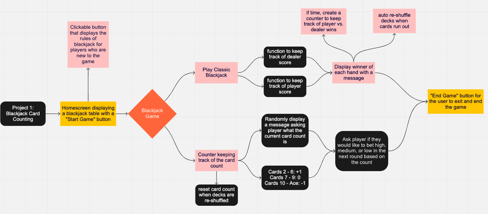
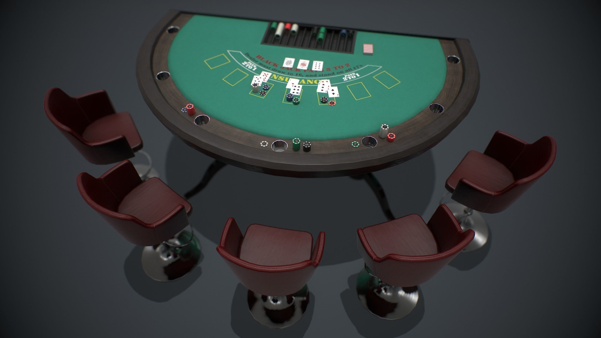
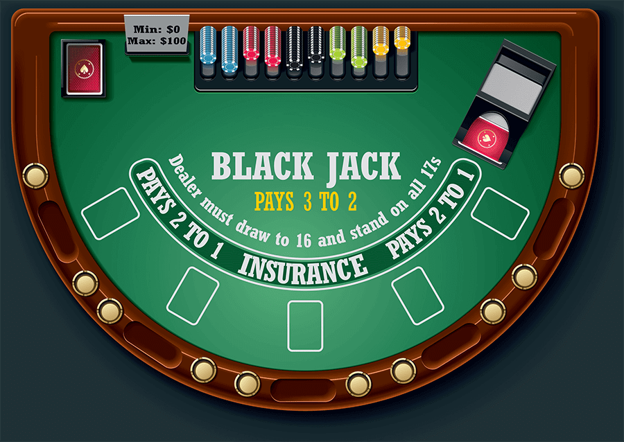

# Bringing Down the House!
Game to Teach Users How to Play Blackjack and Effectively Count Cards to Increase Player Probability of Winning

# Project Motivation
This project was inspired by my love for math and gambling. I taught myself how to count cards during the pandemic and found the probability/statics involved in the game to be fascinating.

# Project Design
The project design is outlined in the flow chart below. It will be an interactive game where users are able to choose their move (hit, stand, split, double down, etc) depending on the cards dealt and the current card count.

# Game Project Design Flow Chart


At the end of each round, the player will be shown, statistically, how they should have played that hand to increase understanding of the probability involved in the game.

There will be a card counter function built into the game. Messages will pop up randomly to check if the user has been keeping track of the card count. The user will be asked how they should bet based on the card count (high, normal, low).


``` html
Create a homescreen with a "Start" button and a background image of a casino-style blackjack table
Create a POV setting of a player at a blackjack table
Have cards that will be dealt out during the game
```
# Picture of Blackjack Table for Game Homescreen


# Blackjack Table Design for In-Game Use


``` js
Have cards dealt out to the dealer and player at random from a shuffled deck (deck is shuffled after last card is played, if < 4 cards left in deck, shuffle)

Function to keep track of dealer score
Function to keep track of player score
Display winner of each hand with a message

Have buttons for player to bet fake money.
    $5, $10, $25, $50, $100

If time permits, create a counter to keep track of player wins vs. dealer wins. (determine probability)

Counter function to keep track of the card count.

    Cards 2 - 6: +1
    Cards 7 - 9: 0
    Cards 10 - Ace: -1

Reset card count when decks are shuffled
Randomly display a message asking player what the current card count is
Ask player if they would like to bet high, medium, or low in the next round based on the count

"End Game" button for the user to exit and end the game
```


